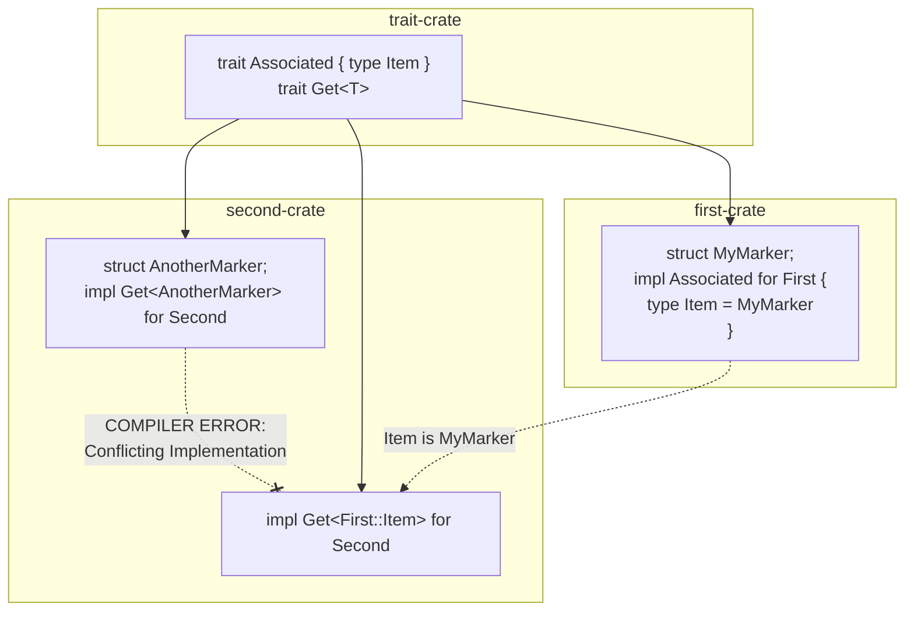
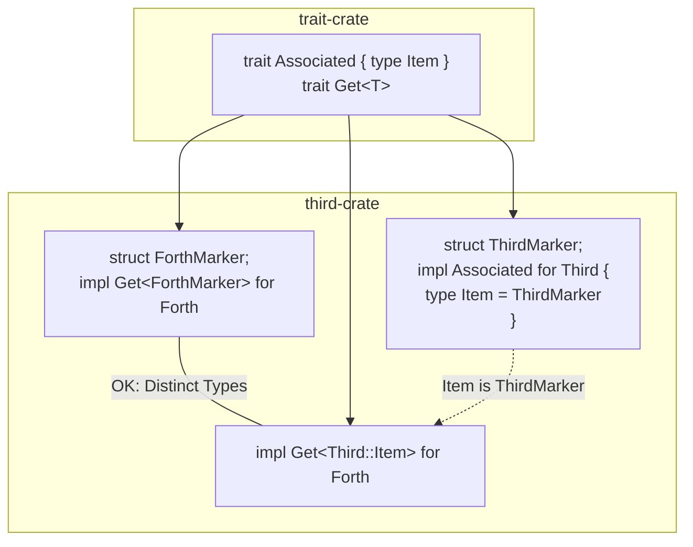

# Rust Trait Collision Limitation Report

This repository demonstrates a limitation in the Rust compiler's trait coherence checker regarding associated types from upstream crates.

## The Setup

The workspace consists of three crates:

1. **`trait-crate`**: Defines a trait `Associated` with an associated type `Item`, and a generic trait `Get<T>`.
2. **`first-crate`**: Defines a struct `MyMarker` and implements `Associated` for a struct `First`, setting `type Item = MyMarker`.
3. **`second-crate`**: Depends on both. It defines a local struct `AnotherMarker` and attempts to implement `Get<T>` for its own struct `Second` twice:
    * `impl Get<AnotherMarker> for Second`
    * `impl Get<<first_crate::First as Associated>::Item> for Second`

## The Issue

Logically, these two implementations should not conflict.

* The first implementation is for `T = AnotherMarker` (a local type in `second-crate`).
* The second implementation is for `T = <First as Associated>::Item`.
* Since `first-crate` defines `Item = MyMarker`, the second implementation resolves to `T = MyMarker` (a type in `first-crate`).
* `AnotherMarker` and `MyMarker` are distinct types defined in different crates.

However, `cargo check` fails with **Error E0119**:

```rust
error[E0119]: conflicting implementations of trait `Get<AnotherMarker>` for type `Second`
  --> second-crate/src/lib.rs:10:1
   |
 9 | impl Get<AnotherMarker> for Second {}
   | ---------------------------------- first implementation here
10 | impl Get<<first_crate::First as Associated>::Item> for Second {}
   | ^^^^^^^^^^^^^^^^^^^^^^^^^^^^^^^^^^^^^^^^^^^^^^^^^^^^^^^^^^^^^ conflicting implementation for `Second`
```

## Explanation

The Rust compiler's coherence checker is conservative. When checking for conflicting implementations, it encounters a projection (an associated type) `<First as Associated>::Item`. Even though the upstream crate `first-crate` has defined this type as `MyMarker`, the compiler in `second-crate` does not fully normalize this projection to `MyMarker` for the purpose of proving disjointness from `AnotherMarker` during the coherence check.

It treats the associated type as something that *could* potentially overlap with `AnotherMarker`, leading to a compilation error. This prevents valid, non-overlapping implementations from being accepted, even when the types involved are clearly distinct structs.

## Illustration



## Control Group: Single Crate Success

The crate **`third-crate`** demonstrates that this is indeed a cross-crate limitation. When all the concrete types and implementations reside in the same crate, the compiler successfully resolves the associated type and proves disjointness.

In `third-crate`:

* Structs `Third`, `ThirdMarker`, `Forth`, `ForthMarker` are defined locally.
* `impl Associated for Third { type Item = ThirdMarker; }`
* `impl Get<ForthMarker> for Forth`
* `impl Get<<Third as Associated>::Item> for Forth`

Here, the compiler sees that `<Third as Associated>::Item` is `ThirdMarker`. Since `ThirdMarker` and `ForthMarker` are distinct local types, it accepts both implementations for `Forth`.


